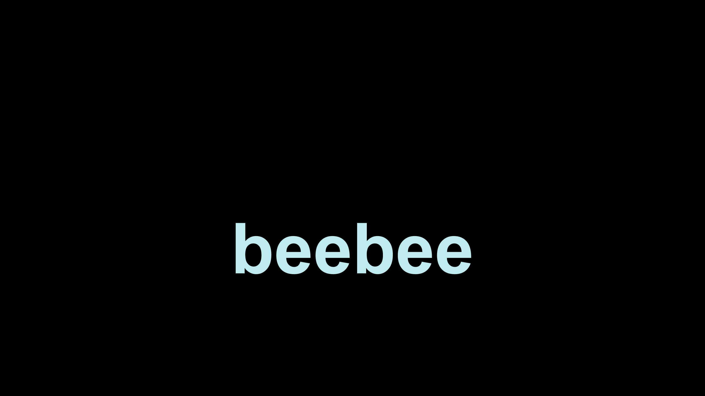
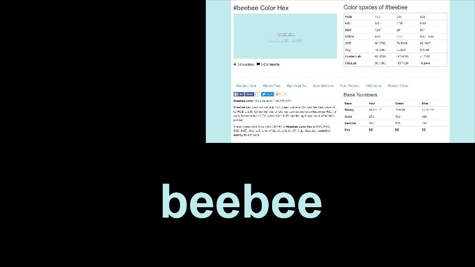
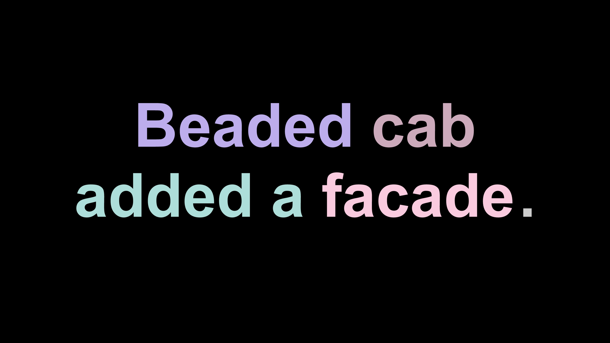
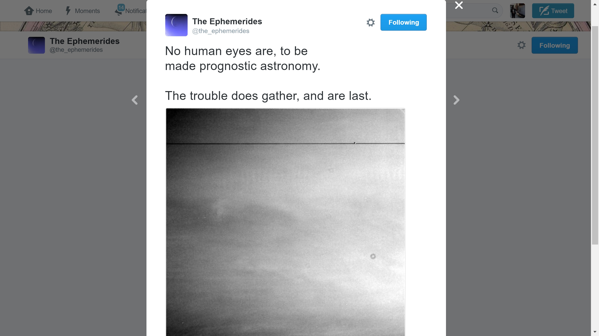

##Hexes and Remexes
####DHUM 503, Introduction to Electronic Literature
####Tiffany Chan
####June 2016

In the Introduction to Electronic Literature course, we discussed an electronic poem by Nick Montfort called [“Hexes.”](http://nickm.com/poems/hexes) This poem consists of a black background with coloured words that flash on the screen in succession.

Devoid of context, the words appear nonsensical or, perhaps playfully, invite the reader to either tease out their pattern of meaning or impose meanings upon them. If one views, and is able to interpret, the source code of the poem, they would discover that each word is also the hexadecimal code that gives the word its colour. As in many works of (electronic) literature, constraints become generative: for example, to work as a hexadecimal code, each word must be exactly six letters long and each letter must be one of the first six letters of the alphabet (a-f). Using these constraints, Montfort generates a list of possible words as well as a script to generate and display an HTML element for each word in its corresponding colour. This white paper analyzes and contextualizes “Hexes” within broader literary or aesthetic movements in (electronic) literature and art. It is also a discussion of and reflection on my remix of or experiment with the code of “Hexes” to generate short sentences and what key differences, similarities, or observations emerged from this process.

As discussed in class, the kinds of generative constraints in “Hexes” are not uncommon across electronic literature—or even printed literature. Examples of the former include Twitterbots while examples of the latter include Raymond Queneau’s Cent Mille Milliards de Poèmes (Hundred Thousand Billion Poems), which is often considered—alongside other [Oulipo](https://en.wikipedia.org/wiki/Oulipo) works—to be a direct predecessor to much algorithmically-generated electronic literature today. One might even think of tightly constrained poetic forms such as the sonnet or the villanelle to work similarly. In technical terms, “Hexes” works like a Twitterbot in that it holds words in a hidden list, and then drawn out of a hat—so to speak—in a pre-determined fashion.
For my remix of Hexes, I expanded the list of words to include three-letter shortcodes for hex colours (e.g. “fee” or #fee) and five-letter words plus the article “a” (e.g. “a decaf”). I also sorted each word or phrase into a separate category according to its part of speech (adjective, noun, verb) and designed a very simple sentence structure in which to “slot” each word or phrase (adjective-noun-verb-noun). Where “Hexes” might simply be a perplexing litany of words, the results of my “Remexes” are often ungrammatical and almost always nonsensical as sentences. Although one could read the semantic meanings that emerge from the sentences or the juxtapositions of words, such interpretations would yield little; it would be hard to defend “Remexes” as good poetry in that sense.

But this failure also foregrounds different ways of meaning or different valuations of poetry. For example, since each word in the list can only include a rather limited subset of the same letters, there is a high chance of alliteration, which draws attention to how sound functions in each lexia (snippet or sentence). Furthermore, altering “Hexes” to output sentences instead of words offers new ways of interpreting the contrasting colours of words in comparison to other words instead of only to the black background. “Remexes” might be more interesting for its colours than its words.
In its attention to sound and colour, my experiment might align itself with [Orphism](https://en.wikipedia.org/wiki/Orphism_(art)), a short-lived artistic movement in the 1910s. Orphists were generally interested in abstraction rather than verisimilitude and focused instead on (the juxtaposition of) bright, contrasting colours and their relation to sensation or affect. The colours, on a black background, appear pastel-like and have a soothing quality. This is likely because of how hexadecimal codes translate into colours (at least according to my rudimentary experiments with [colorpicker.com](http://www.colorpicker.com/)). In the range of possible values (0-9 and a-f) for each digit of the six-character value, letters give you a lighter range of colours than numbers.

“Remexes” does for language what Orphism sought to do for visual art: it seems to detach words from their semantic referents and abstract them into colour. Just as Orphists avoid real world referents in their paintings, so does the poem resist semantic sense even as it retains the loosely recognizable structure of a sentence. Following this translation from letters, words, and sentences into hexadecimal colour values also highlights the ways in which both human and computer languages are symbolic codes—and how much we humans rely on language to “see” the world.
When recreating Orphism in a digital space, however, one might also consider the ways in which humans and computers make meaning. Both “Hexes” and “Remexes” play with the ways in which humans and computers interpret colour; where humans might see words, computers see colours.

*a screen capture of Allison Parrish's bot, ["The Ephemerides"](https://twitter.com/the_ephemerides).*

In teasing out this thread, I find Allison Parrish’s discussion of computer-generated poetry in her talk, [“Exploring (Semantic) Space with (Literal) Robots,”](http://opentranscripts.org/transcript/semantic-space-literal-robots/) to be especially insightful. There, Parrish imagines her bot as a space probe that explores the vast linguistic unknown—the meanings and semantic spaces humans have yet to reach—and sends information back to its human creators. In this way, computers can circumvent or defy human assumptions to discover what alternative, unexpected meanings might be possible. But the “data” it collects, if meant for a human audience, ultimately relies on individuals to interpret and make sense of them. In both poems, as in all computer-generated poetry, meaning emerges in the interplay of human and computer vision.
